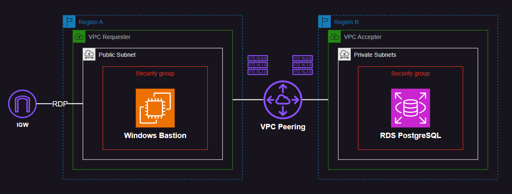

# AWS VPC Peering

AWS VPC cross-region peering.



Generate the temporary keys for SSH (if needed):

```sh
mkdir keys
ssh-keygen -f keys/temp_key
```

To convert from OPENSSH to RSA:

```sh
ssh-keygen -p -m PEM -f keys/temp_key
```

Copy the `.auto.tfvars` sample file:

```sh
cp samples/sample.tfvars .auto.tfvars
```

Create the infrastructure:

```sh
terraform init
terraform apply -auto-approve
```

Start a session using the bastion host and test the connection with peered VPC.

---

### Clean-up

```sh
terraform destroy -auto-approve
```
